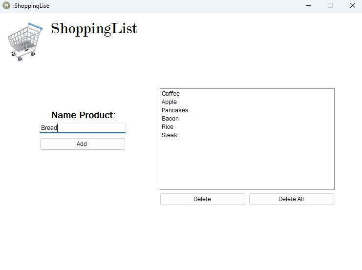

# Simple Shopping List Manager - C# Windows Forms

A simple **shopping list manager** built with **C# Windows Forms**. This application allows users to add, remove, and manage items in a shopping list. It is designed as a small and user-friendly project, perfect for learning basic C# and Windows Forms concepts.

---

## Features

- **Add items**: Users can type an item into the text box and add it to the list.
- **Remove a specific item**: Users can select an item from the list and remove it.
- **Clear the entire list**: Users can delete all items from the list with a single click.
- **User-friendly interface**: Simple and intuitive UI built with Windows Forms.
- **Keyboard support**: Add items by pressing the `Enter` key.

---

## Screenshot

---

## How to Use

1. **Open the application**: Launch the executable or run the project in Visual Studio.
2. **Add an item**: Type the item name in the text box and press the **Add** button or hit `Enter`.
3. **Remove an item**: Select the item from the list box and click **Remove Selected**.
4. **Clear all items**: Click the **Clear List** button to remove everything.
5. **View notifications**: Messages will appear confirming actions like adding or removing items.

---